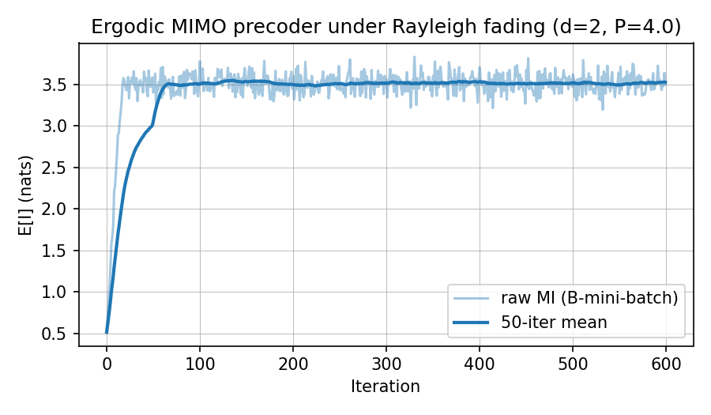
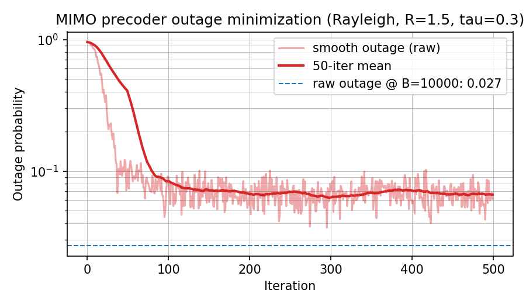

# fading-dag

[](LICENSE)
[](https://www.python.org/)

Fading-channel mutual-information evaluation and SGD-based optimization
for linear Gaussian directed acyclic graphs (DAGs). Adds a
**mini-batched Monte Carlo layer** over channel-matrix realizations,
turning the deterministic-channel K-recursion into a per-realization
evaluator that produces

```
I_sample(V_A; V_B | V_C),  b = 0, ..., B-1   (one per channel realization)
```

and from which both **ergodic** and **outage** performance measures follow:

```
E[I(V_A; V_B | V_C)]                via mini-batch mean
Pr[Σ α · I(V_A;V_B|V_C) < R]        via empirical CDF
                                    (with a sigmoid surrogate for gradients)
```

Each edge of the DAG is represented as a `(H_sampler, F)` 2-tuple:

- `H_sampler: Callable[[int], Tensor]` — a callable that, given a
  mini-batch size `B`, returns `B` independent realizations of the
  channel matrix. Built-in factories cover Rayleigh, Ricean,
  Kronecker-correlated, scaled-Rayleigh, and deterministic fading.
- `F: Tensor` — the deterministic controllable factor (precoder, relay
  gain, ...), `requires_grad=True`. Single tensor; no batch dimension.

The K-recursion is batched over the channel realizations; gradients
flow to `F` via mean-aggregation of the per-realization scalar loss.
The same projector toolbox (Frobenius ball, total-power) used by
`gaussian-dag` and `cmi-dag` plugs into the SGD loop unchanged. Every
component is end-to-end differentiable, device-agnostic (CPU / CUDA),
and built on the parent libraries' vendored numerical primitives — there
is no runtime dependency on either of them.

## Sister libraries

`fading-dag` is one of four standalone members of the Gaussian-DAG
family, all sharing the same K-recursion / complex-autograd /
projected-gradient design and vendoring identical numerical primitives:

| Library | Scope | When to use |
| --- | --- | --- |
| [`gaussian-dag`](https://github.com/wadayama/gaussian-dag) | Single-pair MI on deterministic linear Gaussian DAGs (parent). | Single-link MIMO, multi-hop AF relay, diamond, input-covariance shaping. |
| [`cmi-dag`](https://github.com/wadayama/cmi-dag) | Multi-root + conditional MI on arbitrary disjoint subsets; rate-region facets. | MAC, BC, IC, wiretap, multi-terminal rate regions. |
| [`bussgang-dag`](https://github.com/wadayama/bussgang-dag) | Nonlinear node elements via Bussgang surrogate MI. | Soft-clipping PAs, low-resolution ADCs, hard-decision relays. |
| [`fading-dag`](https://github.com/wadayama/fading-dag) | Random channel matrices via mini-batched Monte Carlo; ergodic capacity and outage. | Rayleigh / Ricean / Kronecker-correlated fading. |

> **Funding.** This work was supported by JST, CRONOS, Japan Grant
> Number **JPMJCS25N5**.

---

## Requirements

- Python ≥ 3.12
- PyTorch ≥ 2.12 (the only required runtime dependency; NumPy ≥ 2.0 is
  also pulled in)
- [`uv`](https://docs.astral.sh/uv/) for environment management
  (recommended)

`fading-dag` is fully self-contained: it has **no `gaussian-dag` or
`cmi-dag` runtime dependency**. The generic numerical primitives shared
with the parent libraries (`get_K`, `hermitianize`, `logdet_hpd`,
`pga_ascent`, the projectors) are vendored here, byte-identical to or
extended from the parent versions.

## Installation

```bash
git clone https://github.com/wadayama/fading-dag.git
cd fading-dag
uv sync
```

This creates `.venv/` and installs all locked dependencies. Run any
subsequent command via `uv run python ...` or `uv run pytest`.

Confirm the install:

```bash
uv run pytest
```

You should see all 73 tests pass in a few seconds.

To run the figure-reproduction examples, install the optional
`matplotlib` dependency:

```bash
uv sync --extra examples
```

The closed-form theoretical-validation tests require `scipy`:

```bash
uv sync --extra dev
```

## Repository layout

```
fading-dag/
├── fading_dag/      core library (8 modules)
├── tests/           pytest suite (73 tests, 7 files)
├── examples/        2 runnable scripts (paper-style figure reproduction)
├── docs/figures/    curated reference output figures (PNG)
├── pyproject.toml   project metadata and dependencies (uv / pip)
├── LICENSE          MIT
└── README.md        this file
```

The single subdirectory `examples/` carries its own short README. The
batched K-recursion (`compute_k_blocks_multiroot`), per-realization CMI
evaluator (`conditional_mutual_information_from_k`), outage helpers,
sampler factories, and SGD loops all live in this package; for the
deterministic-channel background and the K-recursion's derivation see the
parent libraries
[`gaussian-dag`](https://github.com/wadayama/gaussian-dag) (single-root,
single-pair MI) and
[`cmi-dag`](https://github.com/wadayama/cmi-dag) (multi-root,
multi-terminal conditional MI).

---

## Quick start

### 1. Evaluate per-realization mutual information

A 2×2 single-link Rayleigh MIMO channel `y = H F x + z` with `x ~ CN(0, I)`,
`z ~ CN(0, σ² I)`, `H ~ CN(0, I)` per realization. The K-recursion
produces `B` per-realization MI samples in one forward pass:

```python
import torch
from fading_dag import (
    compute_k_blocks_multiroot,
    conditional_mutual_information_from_k,
    samplers,
)

torch.manual_seed(0)
d, sigma2 = 2, 0.5
F = torch.eye(d, dtype=torch.complex128)        # no precoding (yet).

K = compute_k_blocks_multiroot(
    num_nodes=2,
    roots=[0],
    parents={1: [0]},
    edge_mats={(1, 0): (samplers.rayleigh((d, d)), F)},
    root_covs={0: torch.eye(d, dtype=torch.complex128)},
    noise_covs={1: sigma2 * torch.eye(d, dtype=torch.complex128)},
    batch_size=1000,
)
I_samples = conditional_mutual_information_from_k(K, A=[0], B=[1]).real
print(f"ergodic capacity (B=1000 estimate): {I_samples.mean().item():.4f} nats")
print(f"sample std:                         {I_samples.std().item():.4f}")
```

For the SISO scalar case (`d = 1`) `I_samples.mean()` agrees with
Telatar's `exp(1/γ) · E_1(1/γ)` to within Monte Carlo tolerance — see
`tests/test_theoretical_validation.py`.

### 2. Maximize the ergodic capacity (`sgd_ascent`)

Promote `F` to a trainable precoder, projected onto a Frobenius-power
budget:

```python
import torch
from fading_dag import (
    compute_k_blocks_multiroot,
    conditional_mutual_information_from_k,
    project_frobenius_ball,
    samplers,
    sgd_ascent,
)

torch.manual_seed(0)
d, sigma2, P = 2, 0.5, 4.0
F = (0.2 * torch.randn(d, d, dtype=torch.complex128)).requires_grad_(True)
edge_mats = {(1, 0): (samplers.rayleigh((d, d)), F)}

def ergodic_capacity_surrogate():
    K = compute_k_blocks_multiroot(
        num_nodes=2,
        roots=[0],
        parents={1: [0]},
        edge_mats=edge_mats,
        root_covs={0: torch.eye(d, dtype=torch.complex128)},
        noise_covs={1: sigma2 * torch.eye(d, dtype=torch.complex128)},
        batch_size=64,
    )
    return conditional_mutual_information_from_k(K, A=[0], B=[1]).real.mean()

history = sgd_ascent(
    ergodic_capacity_surrogate, [F],
    step_size=0.05, num_iters=300,
    projector=lambda ps: [project_frobenius_ball(p, P=P) for p in ps],
)
print(f"E[I]: {history[0]:.3f} -> {history[-1]:.3f} nats")
print(f"||F||_F  = {torch.linalg.norm(F.detach()).item():.3f}   (budget = {P**0.5:.3f})")
```

`E[I]` rises from `~0.5` to `~3.5` nats and `F` saturates the budget
boundary (`||F||_F = sqrt(P)`); see
`examples/ergodic_mimo_precoder.py` for the full plotting code.

### 3. Minimize the outage probability (`sgd_descent`)

Replace the surrogate by the **smooth outage** at a target rate `R` and
swap `sgd_ascent` for `sgd_descent`:

```python
import torch
from fading_dag import (
    compute_k_blocks_multiroot,
    conditional_mutual_information_from_k,
    outage_probability, outage_probability_smooth,
    project_frobenius_ball,
    samplers,
    sgd_descent,
)

torch.manual_seed(11)
d, sigma2, P, R, tau = 2, 1.0, 5.0, 1.5, 0.3
F = (0.3 * torch.randn(d, d, dtype=torch.complex128)).requires_grad_(True)
edge_mats = {(1, 0): (samplers.rayleigh((d, d)), F)}

def smooth_outage_cost():
    K = compute_k_blocks_multiroot(
        num_nodes=2,
        roots=[0],
        parents={1: [0]},
        edge_mats=edge_mats,
        root_covs={0: torch.eye(d, dtype=torch.complex128)},
        noise_covs={1: sigma2 * torch.eye(d, dtype=torch.complex128)},
        batch_size=128,
    )
    I = conditional_mutual_information_from_k(K, A=[0], B=[1]).real
    return outage_probability_smooth(I, R=R, tau=tau)

history = sgd_descent(
    smooth_outage_cost, [F],
    step_size=0.1, num_iters=500,
    projector=lambda ps: [project_frobenius_ball(p, P=P) for p in ps],
)
print(f"smooth outage: {history[0]:.3f} -> {history[-1]:.3f}")
# Post-training raw-indicator outage at a larger evaluation batch.
with torch.no_grad():
    K_eval = compute_k_blocks_multiroot(
        num_nodes=2, roots=[0], parents={1: [0]}, edge_mats=edge_mats,
        root_covs={0: torch.eye(d, dtype=torch.complex128)},
        noise_covs={1: sigma2 * torch.eye(d, dtype=torch.complex128)},
        batch_size=10_000,
    )
    I_eval = conditional_mutual_information_from_k(K_eval, A=[0], B=[1]).real
print(f"raw outage @ B=10k: {outage_probability(I_eval, R=R).item():.4f}")
```

The smooth outage drops by more than 15× and the raw indicator at a
10k-sample evaluation batch falls to ~3%; see
`examples/outage_minimizing_precoder.py` for the full plotting code and
the [sigmoid saturation caveat](#caveat-sigmoid-saturation-when-training-with-outage_probability_smooth)
below for hyperparameter guidance.

---

## Public API

All symbols below are re-exported from the top-level package:

```python
from fading_dag import (
    compute_k_blocks_multiroot,
    conditional_mutual_information_from_k,
    ergodic_capacity,
    outage_probability, outage_probability_smooth,
    Summand, evaluate_rate_functions,
    sgd_ascent, sgd_descent,
    project_frobenius_ball, project_total_power,
    samplers,
)
```

### Core evaluators

| Symbol | Module | Purpose |
| --- | --- | --- |
| `compute_k_blocks_multiroot(num_nodes, roots, parents, edge_mats, root_covs, noise_covs, *, batch_size, symmetrize_self_blocks=True)` | `krecursion` | **Batched** forward pass of the multi-root K-recursion for a DAG whose edges are `(H_sampler, F)` 2-tuples. Each sampler is called *exactly once* with `batch_size`; the returned dict has uniform 3-D blocks `(B, d_j, d_k)`. Root-root blocks are stored unbatched and `expand`-promoted to 3-D for memory efficiency. Differentiable through every `F`. |
| `conditional_mutual_information_from_k(K, A, B, C=(), *, jitter=0.0)` | `information` | `I(V_A; V_B \| V_C)` evaluated **per channel realization**: returns a real tensor of shape `(B,)` (nats). Aggregation (mean, outage, etc.) is the caller's responsibility. Differentiable through `K`. |
| `Summand` | `rate_region` | `tuple[float, Sequence[int], Sequence[int], Sequence[int]]` representing one term `α · I(V_A; V_B \| V_C)` of a rate function. |
| `evaluate_rate_functions(K, inequalities, *, jitter=0.0)` | `rate_region` | Evaluate a family of rate functions `f_T = Σ_n α_{T,n} · I_n` from one K-recursion forward pass. Each entry of the returned list is shape `(B,)`. |

### Aggregation helpers

| Symbol | Module | Purpose |
| --- | --- | --- |
| `ergodic_capacity(I_samples)` | `outage` | `I_samples.mean()`. Differentiable; suitable as an SGD-ascent loss for ergodic capacity. |
| `outage_probability(I_samples, R)` | `outage` | Empirical CDF `(I_samples < R).float().mean()`. **Not** differentiable (detached); for evaluation only. |
| `outage_probability_smooth(I_samples, R, tau)` | `outage` | Sigmoid surrogate `sigmoid((R - I_samples)/tau).mean()`. Differentiable; suitable as an SGD-descent loss. See the [Caveat](#caveat-sigmoid-saturation-when-training-with-outage_probability_smooth). |

### Channel-matrix samplers (`fading_dag.samplers`)

Each factory below returns a `Callable[[int], Tensor]` producing
`(B, d_out, d_in)` complex tensors. The `dtype` defaults to
`torch.complex128`; `device` defaults to `None` (CPU).

| Symbol | Purpose |
| --- | --- |
| `samplers.rayleigh(shape, *, dtype, device)` | i.i.d. Rayleigh: each entry CN(0, 1). |
| `samplers.ricean(shape, H_LOS, K, *, dtype, device)` | Ricean: `sqrt(K/(K+1)) H_LOS + sqrt(1/(K+1)) H_iid`, with caller-supplied LoS matrix `H_LOS` and Ricean factor `K`. |
| `samplers.kronecker(shape, R_rx, R_tx, *, dtype, device)` | Kronecker-correlated Rayleigh: `R_rx^{1/2} H_iid R_tx^{1/2}`. Cholesky factors are cached. |
| `samplers.scaled_rayleigh(shape, sigma, *, dtype, device)` | Rayleigh with per-entry std `sigma` (scalar or `(d_out, d_in)` tensor). |
| `samplers.constant(H_fixed)` | Deterministic; emits `H_fixed.expand(B, ...)` for every call. Use this to combine fading edges and non-fading edges in the same DAG. |

### Optimization

| Symbol | Module | Purpose |
| --- | --- | --- |
| `sgd_ascent(compute_mi, params, *, step_size, num_iters, projector=None)` | `optimize` | Projected SGD-ascent with the same signature and history convention as `cmi-dag`'s `pga_ascent`. The closure is expected to re-sample a fresh mini-batch on every call; `fading_dag.compute_k_blocks_multiroot` does this automatically. |
| `sgd_descent(closure, params, *, step_size, num_iters, projector=None)` | `optimize` | Minimization companion to `sgd_ascent`; identical signature, history is reported in the true sign of the cost (monotonically non-increasing on a successful descent). |
| `project_frobenius_ball(A, P)` | `projections` | Project `A` onto `{X : ||X||_F^2 ≤ P}` (vendored). |
| `project_total_power(params, P)` | `projections` | Uniform rescaling of a list of matrices onto `Σ_m ||A_m||_F^2 ≤ P` (vendored). |

The numerical primitives `logdet_hpd`, `get_K`, and `hermitianize` are
provided directly by this package (vendored from the parent libraries
and extended with leading batch-dimension support where needed) and are
importable from `fading_dag` or its submodules.

---

## Conventions

- **Edge specification.** `edge_mats[(j, i)]` must be a **strict 2-tuple**
  `(H_sampler, F)`. `H_sampler` is `Callable[[int], Tensor]` returning a
  3-D complex tensor `(B, d_j, d_mid)`; `F` is a 2-D complex tensor
  `(d_mid, d_i)`. To model a deterministic edge use
  `samplers.constant(H_fixed)`; to model an edge with no controllable
  factor set `F = torch.eye(d_mid, dtype=torch.complex128)`.
- **Batch dimension placement.** Leading axis. Every K-block has shape
  `(B, d_j, d_k)` after the recursion completes; root-root blocks
  (which are constant across realizations) share memory across the
  batch axis via `Tensor.expand`, so the uniform 3-D layout costs only
  views, not B-fold allocations.
- **Sampler-once invariant.** Each edge's `H_sampler` is called
  **exactly once per `compute_k_blocks_multiroot` invocation**. The
  resulting batch of channel matrices is reused for both the cross- and
  self-block updates, guaranteeing realization-consistent K-blocks. The
  closure used by `sgd_ascent` / `sgd_descent` re-samples by calling
  `compute_k_blocks_multiroot` again on the next iteration. Note that
  the call-once guarantee is per **edge**: attaching the *same* sampler
  object to two edges calls it once for each, producing **independent**
  realizations. To model one physical channel appearing on multiple
  edges, write a custom sampler that draws once per forward pass and
  returns the cached batch on the subsequent call.
- **Noise covariance.** `noise_covs[j] = Σ_j` is a single
  `(d_j, d_j)` tensor (no batch dimension); it broadcasts implicitly
  across the batch axis. Shadowing or per-realization noise-variance
  fluctuations are out of scope (see Known limitations).
- **Per-realization MI.** `conditional_mutual_information_from_k`
  returns a real tensor of shape `(B,)`. Aggregation is the caller's
  responsibility: use `.mean()` for ergodic E[I],
  `outage_probability(I_samples, R)` for empirical Pr[I < R], or
  `outage_probability_smooth(I_samples, R, tau)` for a differentiable
  surrogate.
- **Raw vs. smooth outage.** `outage_probability` returns the raw
  indicator probability and is **not** differentiable (it detaches its
  input); use it for evaluation/reporting only. For training,
  `outage_probability_smooth(I, R, tau)` returns the sigmoid surrogate
  `E[sigma((R - I)/tau)]`, which converges to the raw probability as
  `tau → 0`. See the
  [Caveat section](#caveat-sigmoid-saturation-when-training-with-outage_probability_smooth)
  for `tau` selection guidance.
- **SGD vs. PGA naming.** `sgd_ascent` / `sgd_descent` have **identical
  signatures and history conventions** to `cmi-dag`'s `pga_ascent` /
  `pga_descent`. The rename signals the *stochastic* nature of the
  gradient (mini-batched H realizations); deterministic PGA reduces to
  SGD with `samplers.constant` and any `batch_size`.
- **Multi-root indexing.** Inherited from `cmi-dag`: roots are the
  first `K` nodes `{0, ..., K-1}` (topological-order convention); they
  must be a contiguous prefix and `K < num_nodes`. Each root carries
  its own input covariance via `root_covs[r]`; the K-recursion base
  case enforces `K[(r, r')] = 0` for distinct roots (mutual
  independence).
- **Storage and Hermitian flip.** Only canonical
  lower-triangular blocks are stored (`j ≥ k`). Use
  `fading_dag.get_K(K, a, b)` for symmetric access; it applies the
  Hermitian flip `K_{ab} = K_{ba}^H` automatically and is batch-safe.
- **Complex autograd.** Inherited from `gaussian-dag`. For a complex
  leaf `Θ` and a real scalar loss `L`, PyTorch's `.grad` equals
  `2 · ∂L/∂Θ*` (the Wirtinger gradient without the 1/2 factor; the
  real-Euclidean steepest direction on `Re Θ, Im Θ`). The factor of 2
  is absorbed into the step size of both `sgd_ascent` and
  `sgd_descent`.
- **Units.** All MI values are in **nats**.
- **Domain failures.** Conditional covariances `Σ_{A|C}`,
  `Σ_{A|BC}` must be strictly Hermitian positive-definite. Cholesky
  failures surface as a per-batch diagnostic `ValueError` (not an
  autograd-internal NaN). Mitigate with the `jitter` keyword on the CMI
  / rate-function calls, or by ensuring the noise covariances at all
  non-root nodes are strictly PD.

---

## Examples

Two end-to-end scripts live in [`examples/`](examples/). Curated
reference output figures (from a known-good run) are committed under
`docs/figures/`; re-running the scripts regenerates fresh PNGs next to
the scripts themselves (these regenerated copies are gitignored).

| Command | What it demonstrates |
| --- | --- |
| `uv run python examples/ergodic_mimo_precoder.py` | 2×2 Rayleigh MIMO, maximize `E_H[I(X; HFX+Z)]` under `||F||_F^2 ≤ P` via `sgd_ascent` + Frobenius-ball projector. `E[I]` rises from ~0.5 nats to ~3.5 nats in 300 iterations; `F` saturates the budget boundary. |
| `uv run python examples/outage_minimizing_precoder.py` | Same DAG, minimize the smooth outage surrogate at a target rate `R` via `sgd_descent`. Smooth outage drops by 15× (~0.96 → ~0.07); raw indicator at a 10k-sample evaluation batch falls to ~3%. |

### `examples/ergodic_mimo_precoder.py`



### `examples/outage_minimizing_precoder.py`



See [`examples/README.md`](examples/README.md) for output conventions
and reproducibility notes.

---

## Tutorials

A five-part beginner walkthrough is available under [`docs/`](docs/README.md):

1. [Installation and your first per-realization MI](docs/tutorial-1-installation-and-first-per-realization-mi.md)
2. [The `(H_sampler, F)` edge specification and sampler factories](docs/tutorial-2-edge-spec-and-samplers.md)
3. [Ergodic capacity maximization with `sgd_ascent`](docs/tutorial-3-ergodic-capacity-with-sgd-ascent.md)
4. [Outage probability and the sigmoid surrogate](docs/tutorial-4-outage-and-sigmoid-surrogate.md)
5. [Fading MAC and rate functions](docs/tutorial-5-fading-mac-and-rate-functions.md)

Working through the parent libraries' tutorial series first will make
these substantially easier — `gaussian-dag` introduces the single-root
K-recursion, log-det MI, projected gradient ascent, and projector
primitives; `cmi-dag` extends them to multi-root, conditional MI, and
rate-region constraints. This library combines the two with a
mini-batched Monte Carlo layer over channel-matrix realizations.

---

## Caveat: sigmoid saturation when training with `outage_probability_smooth`

The smooth surrogate

```
out_smooth(I, R, tau) = E[ sigma((R - I) / tau) ]
```

is the standard tool for back-propagating through outage probability, but
its gradient with respect to `F` flows through `sigma'((R - I)/tau)`, which
**vanishes whenever every channel realization sits far on one side of the
threshold** (saturation regime). Two practical symptoms:

- `F` is initialized at a very small magnitude → every realization gives
  `I ≈ 0 ≪ R` → `sigma((R - I)/tau) ≈ 1` → `sigma'(.) ≈ 0` → gradient
  vanishes and `F` never grows.
- `tau` is set very small from the start → the surrogate is essentially a
  step function; any realization away from `R` contributes zero gradient.

Three remedies that work well in our experiments:

1. **Initialize `F` at a moderate magnitude**, e.g. half the Frobenius
   budget, so that some realizations already straddle the threshold and
   the sigmoid is firmly in its responsive region.
2. **Start with a generous `tau` (e.g. 0.3–0.5) and anneal it down**
   during training (or pick a fixed `tau` that yields a non-trivial
   initial surrogate value). The `test_theoretical_validation` suite
   uses `tau=0.3` precisely for this reason.
3. **Use a large mini-batch** (256–1024). Mini-batch noise on the
   surrogate gradient grows as `1/sqrt(B)`; pushing `B` up makes the
   gradient step reliable enough to break out of nearly-saturated
   regions.

The included `examples/outage_minimizing_precoder.py` illustrates all
three: `F` is initialized at a moderate magnitude, `tau=0.3`, and
`batch_size=128`. With those choices the smooth outage drops by more than
an order of magnitude in 500 iterations and `F` saturates the budget
boundary. The companion test
`tests/test_theoretical_validation.py::test_sgd_descent_reaches_closed_form_siso_outage_minimum`
verifies that the trained SGD optimum matches the closed-form Rayleigh-SISO
optimum `1 - exp(-(e^R - 1) / P)` within Monte Carlo tolerance.

---

## Tests

```bash
uv run pytest tests/                                          # 73 tests
uv run pytest tests/test_theoretical_validation.py -v         # closed-form checks
```

The suite splits into:

- **Module tests** (`test_samplers`, `test_krecursion_batched`,
  `test_information_batched`, `test_outage`, `test_optimize`) — unit
  and integration tests for every module: shape and dtype invariants,
  per-realization equivalence to a per-sample loop, gradient flow to
  `F`, sampler-once invariance, error handling, and SGD convergence on
  simple problems.
- **Theoretical validation** (`test_theoretical_validation`) —
  closed-form ground-truth checks: Telatar's SISO Rayleigh ergodic
  capacity `exp(1/γ) · E_1(1/γ)` at three SNR values, the SISO Rayleigh
  outage `1 − exp(−(e^R − 1)/γ)` at five (γ, R) pairs, an exact match
  between `samplers.constant` and the deterministic log-det MI to
  machine precision, the `tau → 0` convergence of the smooth surrogate
  toward the raw probability, and an SGD-convergence test that verifies
  the trained outage matches the closed-form SISO Rayleigh optimum
  within Monte Carlo tolerance.

All 73 tests run in a few seconds on CPU; the closed-form Monte Carlo
validation tests (B = 50k–100k samples, 500-iteration SGD) dominate the
runtime.

---

## GPU support

The library is **device-agnostic**: every internally allocated tensor
(zero off-diagonal root blocks, jitter matrices, sampler scratch
tensors, etc.) inherits `dtype` and `device` from its input tensors, and
no module hard-codes `device="cpu"`. The K-recursion, conditional MI,
rate functions, outage helpers, and SGD pipeline all run on whichever
device PyTorch places the inputs on.

All five sampler factories expose a `device` keyword argument that is
honored throughout the sampler's lifetime (Rayleigh / Ricean /
scaled-Rayleigh draws happen on the requested device; Kronecker's
Cholesky factors are cached on the requested device at construction).

To move a fading-DAG workload to CUDA, allocate the input tensors
(`Sigma_root`, `Sigma_z`, `F`, and any `H_LOS` / `R_rx` / `R_tx` for
Ricean and Kronecker samplers) on `cuda`, pass `device='cuda'` to the
sampler factories, and the rest of the pipeline follows. The
`complex128` dtype is supported on both CPU and CUDA.

---

## Known limitations

- **Scope.** Linear Gaussian DAGs with **random channel matrices** only.
  Nonlinear node elements (saturating amplifiers, quantisers,
  hard-decision relays) are not directly supported; see the sister
  library `bussgang-dag` for Bussgang-surrogate handling.
- **Per-realization fading model.** Each forward pass draws
  *independent* realizations within a mini-batch. Block fading (a
  shared realization across a sub-batch) and time-correlated fading
  (AR-1 in time) are not directly supported, though a user can
  implement either via a custom stateful sampler that conforms to the
  `Callable[[int], Tensor]` signature.
- **Noise covariance is not batched.** `Σ_j` is a single
  `(d_j, d_j)` tensor; per-realization noise-variance fluctuations
  (e.g., shadowing on noise) are out of scope in v0.x.
- **No `compute_effective_channel` (yet).** `cmi-dag` provides
  `(G, C)` representation of the multi-root DAG; the batched version is
  not yet ported. The K-recursion is sufficient for all current use
  cases (MI / outage evaluation, ergodic SGD).
- **Optimization caveats.** `sgd_ascent` / `sgd_descent` are
  intentionally minimal: constant step size, no momentum, no line
  search, no early stopping. Non-convex objectives are reached only to
  stationary points; multi-start is recommended for production use.
  For outage objectives in particular, see the
  [sigmoid saturation caveat](#caveat-sigmoid-saturation-when-training-with-outage_probability_smooth).
- **Positive-definiteness.** Conditional covariances `Σ_{A|C}`,
  `Σ_{A|BC}` must be strictly PD for the Cholesky log-det. Failures
  surface as a per-batch diagnostic `ValueError`. Mitigate via the
  `jitter` keyword or by tightening the noise-covariance assumptions.
- **Numerical reproducibility.** Single-run numbers depend on the
  PyTorch and NumPy versions and the random-number generation paths
  therein. Last-digit drift across versions is expected and is not a
  regression.

---

## Citation

If you use this library in academic work, please cite the repository:

```bibtex
@software{wadayama_fading_dag,
  author  = {Wadayama, Tadashi},
  title   = {{fading-dag}: mini-batched {M}onte {C}arlo mutual
             information over random channel matrices on linear
             {G}aussian {DAG}s},
  year    = {2026},
  version = {0.1.0},
  url     = {https://github.com/wadayama/fading-dag},
}
```

### Acknowledgement

This work was supported by JST, CRONOS, Japan Grant Number JPMJCS25N5.

---

## License

`fading-dag` is released under the [MIT License](LICENSE).
